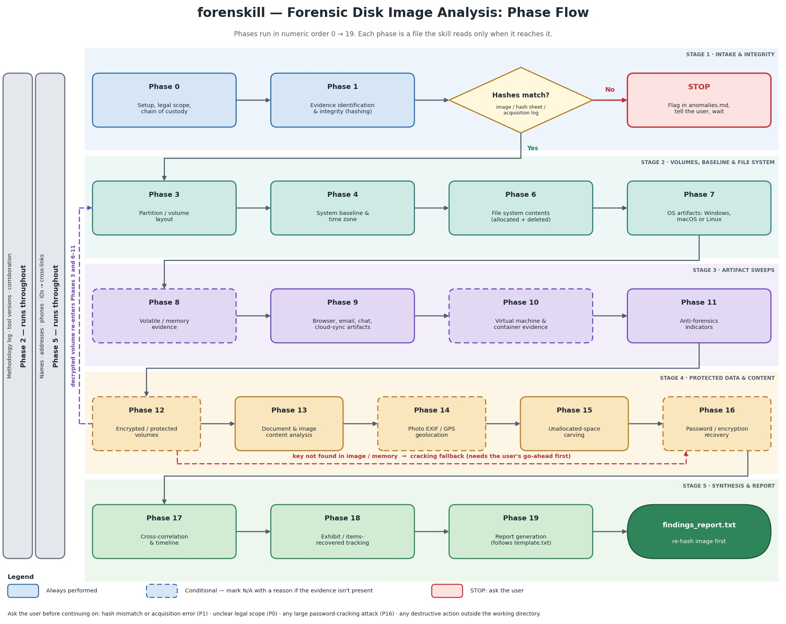

# forenskill

A [Claude Code skill](https://docs.claude.com/en/docs/claude-code/skills) for
forensic analysis of computer disk images. It gives Claude a phase-by-phase
operating procedure for examining raw/dd, E01/EWF, AFF, and VMDK/VHD images
and memory captures: integrity verification, volume and file system analysis,
deleted-file recovery and carving, Windows/macOS/Linux artifacts, browser,
email, chat and cloud-sync artifacts, encrypted volumes, timelines, and a
final findings report.

The procedure follows published standards (NIST SP 800-86, SWGDE, ACPO,
ISO/IEC 27037, RFC 3227); see
[sources](skills/forenskill/reference/sources.md).



## Repository layout

```
skills/forenskill/   the skill itself: everything Claude loads
docs/                documentation and the phase flowchart (not loaded by Claude)
```

## Install

Clone the repo, then link or copy the skill folder into your skills directory.

Symlink (a later `git pull` updates the installed skill):

```bash
git clone https://github.com/<your-username>/forenskill.git
mkdir -p ~/.claude/skills
ln -s "$(pwd)/forenskill/skills/forenskill" ~/.claude/skills/forenskill
```

Or copy:

```bash
mkdir -p ~/.claude/skills
cp -r forenskill/skills/forenskill ~/.claude/skills/
```

Then ask Claude Code to examine a disk image, for example:

> Examine the disk image at /cases/item42/disk.E01 — case 2026-014.

The skill creates its case directory (`case_<id>/`) in your current working
directory, not inside the skill.

## How it works

`skills/forenskill/SKILL.md` holds what applies to every phase: the Hard
Rules, inputs, case directory layout, tool inventory, and the phase map. Each
phase's detail lives in its own file, which Claude reads only when it reaches
that phase.

| Phase | Topic | File |
|---|---|---|
| 0–1 | Setup, legal scope, chain of custody; evidence integrity | [intake-integrity.md](skills/forenskill/intake-integrity.md) |
| 2, 5 | Methodology logging; subject identification (run throughout) | [conventions.md](skills/forenskill/conventions.md) |
| 3–4 | Volume layout; system baseline and time zone | [volumes-baseline.md](skills/forenskill/volumes-baseline.md) |
| 6, 15 | File system contents; unallocated-space carving | [filesystem.md](skills/forenskill/filesystem.md) |
| 7 | OS artifacts | [os/](skills/forenskill/os/) |
| 8 | Memory evidence | [memory.md](skills/forenskill/memory.md) |
| 9 | Browser, email, chat, cloud-sync artifacts | [user-activity/](skills/forenskill/user-activity/) |
| 10 | Virtual machines and containers | [virtualization.md](skills/forenskill/virtualization.md) |
| 11 | Anti-forensics indicators | [anti-forensics.md](skills/forenskill/anti-forensics.md) |
| 12, 16 | Encrypted volumes; password recovery | [encryption.md](skills/forenskill/encryption.md) |
| 13–14 | Document/image content; photo EXIF and GPS | [content-analysis.md](skills/forenskill/content-analysis.md) |
| 17–19 | Correlation and timeline; exhibits; report | [correlation-report.md](skills/forenskill/correlation-report.md) |

The final report follows [template.txt](skills/forenskill/template.txt).

## Requirements

Most phases depend on [The Sleuth Kit](https://www.sleuthkit.org/). Other
tools are used where present (libewf, ExifTool, bulk_extractor, foremost,
binwalk, RegRipper, Volatility 3, Plaso, John, Hashcat). Check what's
installed with:

```bash
bash skills/forenskill/scripts/tool_inventory.sh
```

## Safe handling

The skill never writes to the original evidence and works from a copy or a
read-only mount. It stops and asks you on hash mismatches, unclear legal
scope, large password-cracking attacks, and destructive actions. Case data
is git-ignored (`case/`, `case_*/`, image and memory-dump file types) so
evidence is not committed by accident.

## Intended use

For authorized examinations only: work you are legally entitled to perform,
such as under a warrant, consent, or an engagement letter. Confirm the legal
authority and scope before examining any evidence.

## License

[MIT](LICENSE)

## Regenerating the flowchart

```bash
python3 docs/make_flowchart.py    # needs matplotlib and Pillow
```
